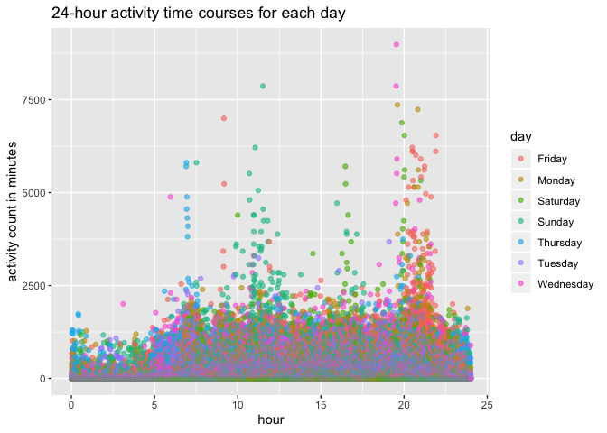
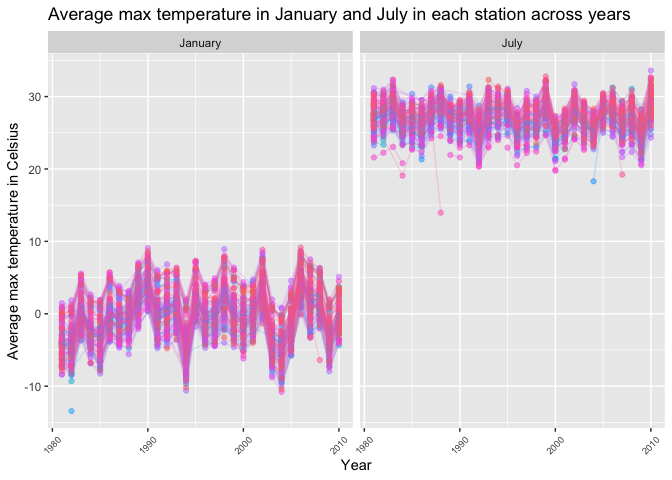
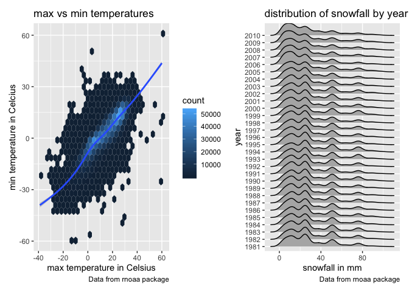

hw3
================
Yue Chen
10/6/2020

``` r
library(tidyverse)
```

    ## ── Attaching packages ────────────────────────────────────────────────────────────── tidyverse 1.3.0 ──

    ## ✓ ggplot2 3.2.1     ✓ purrr   0.3.4
    ## ✓ tibble  3.0.3     ✓ dplyr   0.8.3
    ## ✓ tidyr   1.0.0     ✓ stringr 1.4.0
    ## ✓ readr   1.3.1     ✓ forcats 0.4.0

    ## Warning: package 'tibble' was built under R version 3.6.2

    ## Warning: package 'purrr' was built under R version 3.6.2

    ## ── Conflicts ───────────────────────────────────────────────────────────────── tidyverse_conflicts() ──
    ## x dplyr::filter() masks stats::filter()
    ## x dplyr::lag()    masks stats::lag()

``` r
library(ggridges)
library(patchwork)
```

    ## Warning: package 'patchwork' was built under R version 3.6.2

``` r
library(ggplot2)
library(scales)
```

    ## 
    ## Attaching package: 'scales'

    ## The following object is masked from 'package:purrr':
    ## 
    ##     discard

    ## The following object is masked from 'package:readr':
    ## 
    ##     col_factor

``` r
library(hexbin)
```

## Problem 1

``` r
library(p8105.datasets)
data("instacart")
```

The dataset contains 1384617 rows and 15 columns. Observations are the
level of items in orders by user. There are user / order variables -
user ID, order ID, order day, and order hour. There are also item
variables - name, aisle, department, and some numeric codes.

How many aisles are there, and which aisles are the most items ordered
from?

``` r
instacart %>%
  count(aisle) %>%
  arrange(desc(n))
```

    ## # A tibble: 134 x 2
    ##    aisle                              n
    ##    <chr>                          <int>
    ##  1 fresh vegetables              150609
    ##  2 fresh fruits                  150473
    ##  3 packaged vegetables fruits     78493
    ##  4 yogurt                         55240
    ##  5 packaged cheese                41699
    ##  6 water seltzer sparkling water  36617
    ##  7 milk                           32644
    ##  8 chips pretzels                 31269
    ##  9 soy lactosefree                26240
    ## 10 bread                          23635
    ## # … with 124 more rows

There are 134 aisles. The most ordered aisles are fresh vegetables,
fresh fruits, and packaged vegetable fruits.

Make a plot that shows the number of items ordered in each aisle,
limiting this to aisles with more than 10000 items ordered. Arrange
aisles sensibly, and organize your plot so others can read it.

``` r
instacart %>%
  count(aisle) %>%
  filter(n > 10000) %>%
  mutate(
    aisle = factor(aisle),
    aisle = fct_reorder(aisle, n)
  ) %>%
  ggplot(aes(x = aisle, y = n)) + 
  geom_point() +
  theme(axis.text.x = element_text(angle = 90, vjust = 0.5, hjust = 1))
```

<!-- -->

Make a table showing the three most popular items in each of the aisles
“baking ingredients”, “dog food care”, and “packaged vegetables
fruits”. Include the number of times each item is ordered in your
table.

``` r
instacart %>%
  filter(aisle %in% c("baking ingredient", "dog food care", "packaged vegetables fruits")) %>%
  group_by(aisle) %>%
  count(product_name) %>%
  mutate(rank = min_rank(desc(n))) %>%
  filter(rank < 4) %>%
  arrange(aisle, rank) %>%
  knitr::kable()
```

| aisle                      | product\_name                                 |    n | rank |
| :------------------------- | :-------------------------------------------- | ---: | ---: |
| dog food care              | Snack Sticks Chicken & Rice Recipe Dog Treats |   30 |    1 |
| dog food care              | Organix Chicken & Brown Rice Recipe           |   28 |    2 |
| dog food care              | Small Dog Biscuits                            |   26 |    3 |
| packaged vegetables fruits | Organic Baby Spinach                          | 9784 |    1 |
| packaged vegetables fruits | Organic Raspberries                           | 5546 |    2 |
| packaged vegetables fruits | Organic Blueberries                           | 4966 |    3 |

Make a table showing the mean hour of the day at which Pink Lady Apples
and Coffee Ice Cream are ordered on each day of the week; format this
table for human readers.

``` r
instacart %>%
  filter(product_name %in% c("Pink Lady Apples", "Coffee Ice Cream")) %>%
  group_by(product_name, order_dow) %>%
  summarize(mean_hour = mean(order_hour_of_day)) %>%
  pivot_wider(
    names_from = order_dow,
    values_from = mean_hour
  ) %>%
  knitr::kable()
```

| product\_name    |        0 |        1 |        2 |        3 |        4 |        5 |        6 |
| :--------------- | -------: | -------: | -------: | -------: | -------: | -------: | -------: |
| Coffee Ice Cream | 13.77419 | 14.31579 | 15.38095 | 15.31818 | 15.21739 | 12.26316 | 13.83333 |
| Pink Lady Apples | 13.44118 | 11.36000 | 11.70213 | 14.25000 | 11.55172 | 12.78431 | 11.93750 |

## Problem 2

``` r
accel_data = read_csv("./accel_data.csv") %>%
  janitor::clean_names() %>%
  mutate(
    weekday = recode(day, 
                     "Monday" = "Weekday", 
                     "Tuesday" = "Weekday", 
                     "Wednesday" = "Weekday", 
                     "Thursday" = "Weekday", 
                     "Friday" = "Weekday", 
                     "Saturday" = "Weekend",
                     "Sunday" = "Weekend")) %>%
  pivot_longer(
    activity_1:activity_1440,
    names_to = "activity",
    names_prefix = "activity_", 
    values_to = "count"
  ) %>%
  mutate(
    week = as.integer(week),
    day_id = as.integer(day_id),
    activity = as.integer(activity),
    count = as.numeric(count)
  )
```

    ## Parsed with column specification:
    ## cols(
    ##   .default = col_double(),
    ##   day = col_character()
    ## )

    ## See spec(...) for full column specifications.

In the resulting dataset, there are 50400 observations and the following
variables: week, day\_id, day, weekday, activity, count.

Using your tidied dataset, aggregate accross minutes to create a total
activity variable for each day, and create a table showing these totals.

``` r
accel_data %>%
  group_by(day_id, day, weekday) %>%
  summarise(
    daily_count = sum(count)
  ) %>%
  knitr::kable()
```

| day\_id | day       | weekday | daily\_count |
| ------: | :-------- | :------ | -----------: |
|       1 | Friday    | Weekday |    480542.62 |
|       2 | Monday    | Weekday |     78828.07 |
|       3 | Saturday  | Weekend |    376254.00 |
|       4 | Sunday    | Weekend |    631105.00 |
|       5 | Thursday  | Weekday |    355923.64 |
|       6 | Tuesday   | Weekday |    307094.24 |
|       7 | Wednesday | Weekday |    340115.01 |
|       8 | Friday    | Weekday |    568839.00 |
|       9 | Monday    | Weekday |    295431.00 |
|      10 | Saturday  | Weekend |    607175.00 |
|      11 | Sunday    | Weekend |    422018.00 |
|      12 | Thursday  | Weekday |    474048.00 |
|      13 | Tuesday   | Weekday |    423245.00 |
|      14 | Wednesday | Weekday |    440962.00 |
|      15 | Friday    | Weekday |    467420.00 |
|      16 | Monday    | Weekday |    685910.00 |
|      17 | Saturday  | Weekend |    382928.00 |
|      18 | Sunday    | Weekend |    467052.00 |
|      19 | Thursday  | Weekday |    371230.00 |
|      20 | Tuesday   | Weekday |    381507.00 |
|      21 | Wednesday | Weekday |    468869.00 |
|      22 | Friday    | Weekday |    154049.00 |
|      23 | Monday    | Weekday |    409450.00 |
|      24 | Saturday  | Weekend |      1440.00 |
|      25 | Sunday    | Weekend |    260617.00 |
|      26 | Thursday  | Weekday |    340291.00 |
|      27 | Tuesday   | Weekday |    319568.00 |
|      28 | Wednesday | Weekday |    434460.00 |
|      29 | Friday    | Weekday |    620860.00 |
|      30 | Monday    | Weekday |    389080.00 |
|      31 | Saturday  | Weekend |      1440.00 |
|      32 | Sunday    | Weekend |    138421.00 |
|      33 | Thursday  | Weekday |    549658.00 |
|      34 | Tuesday   | Weekday |    367824.00 |
|      35 | Wednesday | Weekday |    445366.00 |

It is hard to see a trend from the table.

Make a single-panel plot that shows the 24-hour activity time courses
for each day and use color to indicate day of the week.

``` r
accel_data %>%
  mutate(
    hour = activity / 60
  ) %>%
  group_by(hour, week, day, day_id) %>%
  summarise(activity_hour = sum(count)) %>%
  ggplot(aes(x = hour, y = activity_hour, color = day)) +
  geom_point(alpha = 0.6) +
  labs(
    title = "24-hour activity time courses for each day",
    x = "hour",
    y = "activity count in minutes"
  ) 
```

<!-- --> The patient is
generally active at 6-7am on Thursdays, 11-12am on Sundays, 4-5pm on
Saturdays, and 8-10pm on Fridays.The most vigorous activity happened on
a Wednesday at 7-8pm.

## Problem 3

``` r
library(p8105.datasets)
data("ny_noaa")
```

The dataset contains 2595176 rows and 7 columns. The variables are id,
date, prcp, snow, snwd, tmax, tmin.

There are 591786 missing values in snow depth, accounting for 22.8% of
all observations.

There are 1134358 missing values in maximum temperature, accounting for
43.7% of all observations.

There are 1134420 missing values in minimum temperature, accounting for
43.7% of all observations.

Data cleaning. Create separate variables for year, month, and day.
Ensure observations for temperature, precipitation, and snowfall are
given in reasonable units.

``` r
ny_noaa = 
ny_noaa %>%
  janitor::clean_names() %>%
  separate(col = date, into = c("year", "month", "day")) %>%
  mutate(
    year = as.integer(year),
    month = as.integer(month),
    day = as.integer(day),
    month = month.name[month],
    prcp = as.numeric(prcp, na.rm = T) / 10,
    tmax = as.numeric(tmax, na.rm = T) / 10,
    tmin = as.numeric(tmin, na.rm = T) / 10
  )
```

``` r
ny_noaa %>%
  group_by(snow) %>%
  summarise(n = n()) %>%
  filter(min_rank(desc(n)) < 2)
```

    ## # A tibble: 1 x 2
    ##    snow       n
    ##   <int>   <int>
    ## 1     0 2008508

The most observed value in snowfall is 0 because New York state has way
less snow days than days without snow.

Make a two-panel plot showing the average max temperature in January and
in July in each station across years.

``` r
ny_noaa %>% 
  filter(month%in% c("January", "July")) %>% 
  group_by(id, year, month) %>% 
  summarise(tmax_mean = mean(tmax)) %>% 
  ggplot(aes(x = year, y = tmax_mean, color = id, group = id)) +
  geom_point(alpha = 0.5) +
  geom_line(alpha = 0.2) +
  facet_grid(~ month) +
  theme(axis.text.x = element_text(angle = 45, hjust = 0.5, vjust = 0.5,size = 7),legend.position = "none")+
  labs(
    title = "Average max temperature in January and July in each station across years",
    x = "Year",
    y = "Average max temperature in Celsius"
  )
```

    ## Warning: Removed 7058 rows containing missing values (geom_point).

    ## Warning: Removed 6007 rows containing missing values (geom_path).

<!-- --> In general, the
average max temperature in January is lower than that in July. There is
a greater fluctuation of average max temperature in January than that in
July.

Some outliers are Jan 1982, Jul 1988, Jul 2004, and Jul 2007.

Make a two-panel plot showing (i) tmax vs tmin for the full dataset
(note that a scatterplot may not be the best option); and (ii) make a
plot showing the distribution of snowfall values greater than 0 and less
than 100 separately by year.

``` r
plot1 = 
  ny_noaa %>%
  ggplot(
    aes(x = tmax, y = tmin)) + 
  geom_hex() + 
  geom_smooth() + 
  labs(
    title = "max vs min temperatures",
    x = "max temperature in Celsius", 
    y = "min temperature in Celcius", 
    caption = "Data from rnoaa package"
  ) 

plot2 = 
  ny_noaa %>%
  filter(snow > 0 & snow < 100) %>%
  ggplot(
    aes(x = snow, y = as.factor(year))
  ) + 
  geom_density_ridges() + 
  labs(
    title = "distribution of snowfall by year", 
    x = "snowfall in mm", 
    y = "year",
    caption = "Data from rnoaa package"
  )

two_panel_plot = plot1 + plot2

two_panel_plot
```

    ## Warning: Removed 1136276 rows containing non-finite values (stat_binhex).

    ## `geom_smooth()` using method = 'gam' and formula 'y ~ s(x, bs = "cs")'

    ## Warning: Removed 1136276 rows containing non-finite values (stat_smooth).

    ## Picking joint bandwidth of 3.76

<!-- -->
